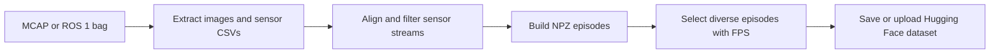
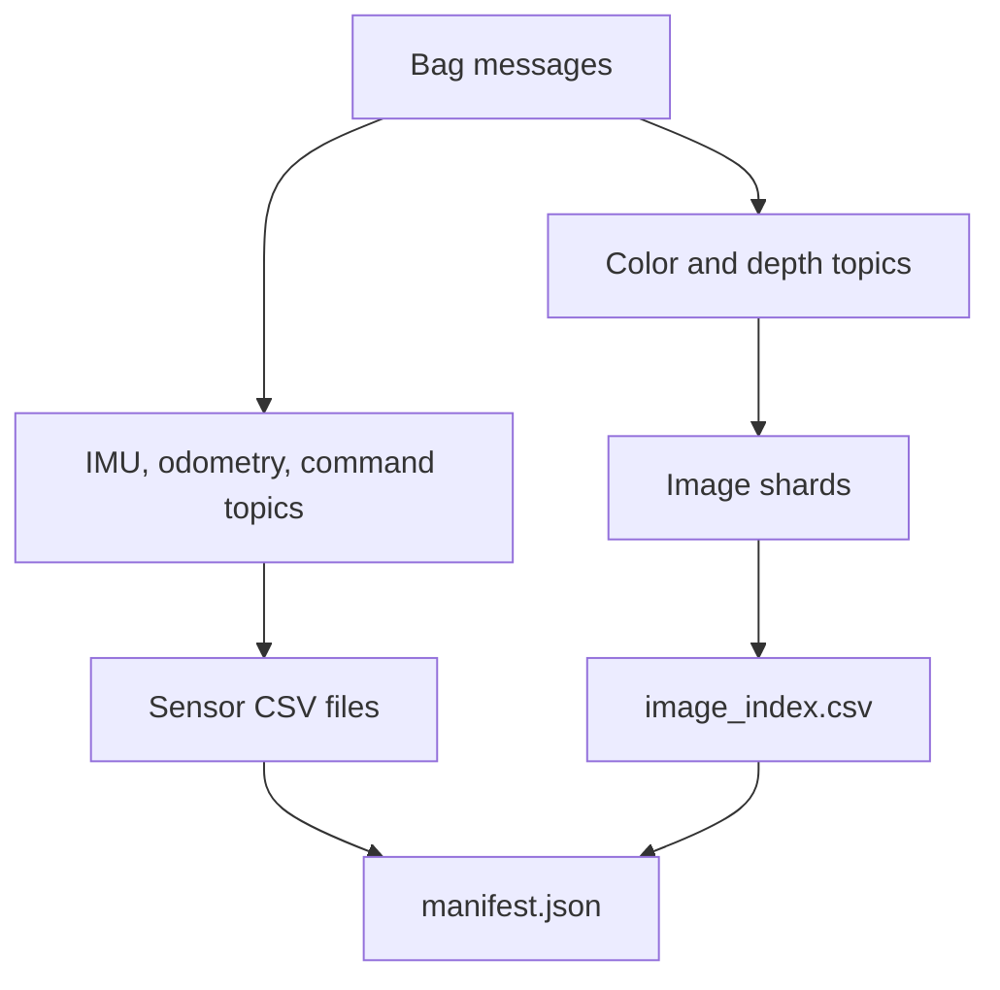
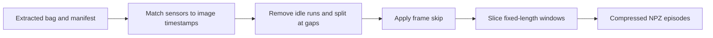
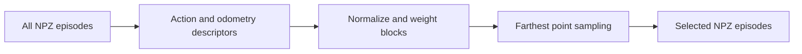
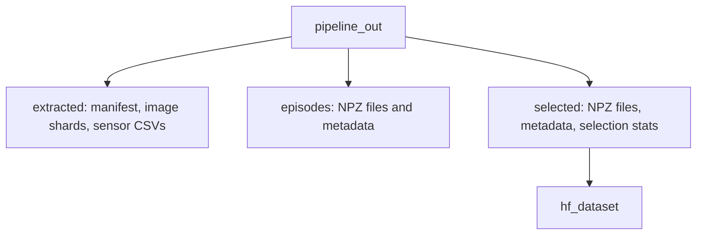

# Data pipeline

The offline pipeline converts ROS 2 MCAP or ROS 1 bag recordings into fixed-length NPZ episodes and, optionally, a Hugging Face dataset. `scripts/world_model/data_pipeline/run_pipeline.py` coordinates the stages.



## Run the pipeline

From the repository root:

```bash
python -m scripts.world_model.data_pipeline.run_pipeline \
  --mcap path/to/mcap --robot <robot_name> \
  --frame-skip 6 --episode-len 50 --stride 50 \
  --target-count 5000 --push-to-hub <hf_repo>
```

To reuse previously extracted bags, pass `--bags pipeline_out` in place of `--mcap` and `--robot`. The repository's Python dependencies include the MCAP readers. The robot configurations are under `configs/robots/`.

## Stage 0: extract bags

`scripts/world_model/data_pipeline/stage0_extract.py` calls the extractor in `scripts/world_model/extract_dataset.py`. The robot configuration maps recorded topics to color, depth, IMU, odometry, and command streams. Extraction writes image shards, CSV sensor logs, an image index, and a manifest. Depth from `32FC1` messages is converted from metres to millimetres for 16-bit PNG storage. Missing sensor streams are handled in the next stage using the configured dimensions.



## Stage 1: build episodes

`scripts/world_model/build_episodes.py` uses image timestamps as the reference clock. It matches each image to the nearest sensor row, zero-filling a missing or too-distant sensor value according to the robot configuration. `--max-sync-gap-ms` limits the allowed time difference. Long idle runs and timestamp gaps split the data into valid contiguous runs; episodes never cross these boundaries.



`--episode-len` is the number of retained frames, `--frame-skip` is their spacing in source frames, and `--stride` is the start spacing before multiplication by frame skip. For example, 50 retained frames at 30 source fps with frame skip 6 span about 10 seconds. The stored arrays are:

| Array | Shape | Meaning |
|---|---|---|
| `rgb` | `(T, H, W, 3)` | Color frames, `uint8` |
| `depth` | `(T, H, W)` | Depth in metres, `float32` |
| `imu` | `(T, D_imu)` | Aligned IMU values |
| `odom` | `(T, D_odom)` | Aligned odometry |
| `action` | `(T, D_act)` | Aligned commands |

`metadata.json` records counts, sensor dimensions, and processing parameters.

## Stage 2: select episodes

`scripts/world_model/select_episodes.py` summarizes each episode with action mean, action standard deviation, and a six-dimensional start-to-end odometry change. It normalizes action and odometry blocks separately, weights them, and uses farthest point sampling (FPS) {cite:p}`gonzalez1985clustering` to select a diverse subset. With `encoder="none"`, action statistics have weight 0.75 and odometry change has weight 0.25. Selection writes sequentially named episodes, `metadata.json`, and `selection_stats.json`.



## Stage 3: save or upload

`scripts/world_model/data_pipeline/hf_upload.py` expands selected episodes into frame rows with episode and frame IDs, images, depth, and numbered sensor columns. It saves a local Hugging Face dataset and can push it to a Hub repository.

```bash
python -m scripts.world_model.data_pipeline.hf_upload \
  --episodes-dir pipeline_out/selected \
  --push-to-hub <hf_repo>
```

## Main CLI options

| Option | Purpose | Default |
|---|---|---|
| `--mcap PATH [...]` | Raw bag input and Stage 0 extraction | — |
| `--bags PATH` | Already extracted bags; skip Stage 0 | — |
| `--robot NAME` | Configuration from `configs/robots/` | See `--help` |
| `--episode-len N` | Retained frames per episode | `50` |
| `--frame-skip N` | Source-frame spacing | `6` |
| `--stride N` | Episode start spacing | `50` |
| `--img-size N` | Resized image width and height | `128` |
| `--min-speed F` | Idle-speed threshold in m/s | `0.1` |
| `--target-count N` | Number of episodes selected | `5000` |
| `--push-to-hub ID` | Dataset repository | — |
| `--hf-private` | Make Hub dataset private | off |
| `--output DIR` | Output directory | `pipeline_out` |
| `--skip-build`, `--skip-select`, `--skip-hf-upload` | Skip corresponding stages | off |

## Output



**Read next**
- [World model](world_model.md) explains the model families and planning path.
- [Training](training.md) contains the existing training and evaluation examples.
- [ROS2](ros2.md) contains ROS2 integration details (e.g., launch arguments, checkpoint requirements, topics and node parameters).