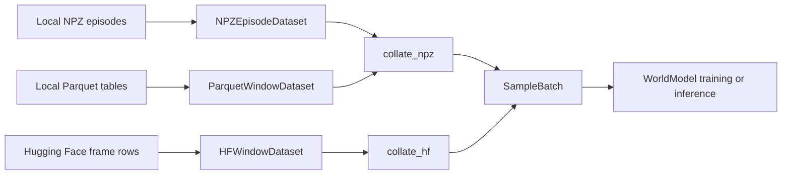
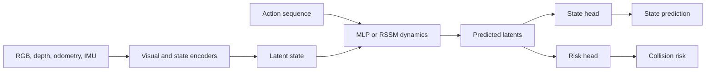
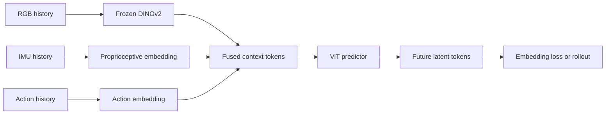
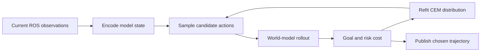

# World-model pipeline

The [data pipeline](data_pipeline.md) produces NPZ episodes and optional Hugging Face frame rows. This guide follows those samples through loading, prediction, and planning.

## Model families and training objectives

| Family | Visual encoder | Prediction path | Training entry point |
|---|---|---|---|
| WorldModel | CNN, DINOv2, or V-JEPA2 | MLP or RSSM latent dynamics, state and risk heads; `standard` or `jepa-lite` training objective | `scripts/world_model/train_wm.py --method wm` (or `train_world_model.py` directly) |
| DinoWM | Frozen DINOv2 patch encoder | Fused visual, proprioceptive, and action tokens through a ViT predictor | `scripts/world_model/train_wm.py --method dinowm` (or `train_world_model_dinowm.py` directly) |

WorldModel lives in `src/world_model/architecture.py`; DinoWM uses `src/world_model/backbones/wm.py`. Its pretrained visual encoders draw on DINOv2 {cite:p}`oquab2023dinov2` and V-JEPA 2 {cite:p}`assran2025vjepa2`. JEPA-lite is a WorldModel training objective {cite:p}`assran2023ijepa` selected by `--method wm --wm_mode jepa-lite`. CNN and DINOv2 can also be paired with RSSM latent dynamics {cite:p}`hafner2019learning` by selecting `--dynamics_type rssm`.

## Loading episodes

`NPZEpisodeDataset` loads local episodes and indexes sliding windows. `HFWindowDataset` groups Hugging Face rows by episode or window and sorts by frame index. Training with `--dataset_type hf` reads local frames/windows Parquet tables through one configurable reader. Their standard collators produce `SampleBatch`, which carries RGB, depth, IMU, odometry, action, and collision tensors.

| `SampleBatch` field | Shape |
|---|---|
| `rgb` | `(B, T, 3, H, W)` |
| `depth` | `(B, T, 1, H, W)` |
| `imu` | `(B, T, D_imu)` |
| `odom` | `(B, T, D_odom)` |
| `action` | `(B, T, D_act)` |
| `collision` | `(B, T, 1)` |

The library API supports opening trajectory windows, training a standard model, checkpointing, and planning. The separate `wm_datasets` package provides video clip and frame-pair loaders.

## Standard WorldModel: CNN, DINOv2, V-JEPA2, and RSSM

The visual backbone encodes observations into a latent state. The dynamics model rolls that state forward under candidate actions. State and risk heads predict task outputs. Training compares latent, state, and collision predictions against targets; `--wm_mode jepa-lite` changes the latent objective to JEPA-style matching.

For standard training, `rollout_loss` combines latent MSE, state MSE, and collision BCE with `lambda_z`, `lambda_state`, and `lambda_risk`. The JEPA-lite option uses a target encoder and latent matching, with an optional variance term. The state decoder and recovery MPC examples are in [Training](training.md).

## DinoWM

DinoWM follows the DINO-WM architecture {cite:p}`zhou2024dinowm`, using frozen DINOv2 visual patch tokens and learned proprioceptive and action embeddings. It fuses the tokens over a history window and predicts future latent tokens with `ViTPredictor`. Its embedding loss compares predictions against target visual and proprioceptive tokens. Pixel reconstruction is absent when the decoder is `None`.

`collate_dinowm` supplies visual and proprioceptive observations plus actions and state. `WM.rollout` autoregressively predicts future fused tokens for evaluation or planning. The DinoWM CLI setup is described in [Training](training.md).

## Planning and the ROS 2 bridge

The cross-entropy method (CEM) {cite:p}`rubinstein1999crossentropy` samples action sequences, rolls them through the selected world model, scores goal distance and risk, and refits its candidate distribution. The bridge package in `ros2/wm_planner_ros` provides a standard model node and a DinoWM node. It subscribes to robot observations and publishes a planned path. See the [ROS 2 wrapper guide](ros2.md) for the shared buffered adapter, all three model paths, checkpoint handling, topics, and node parameters.

**Read next**
- [Training](training.md) contains the existing training and evaluation examples.
- [ROS2](ros2.md) contains ROS2 integration details (e.g., launch arguments, checkpoint requirements, topics and node parameters).